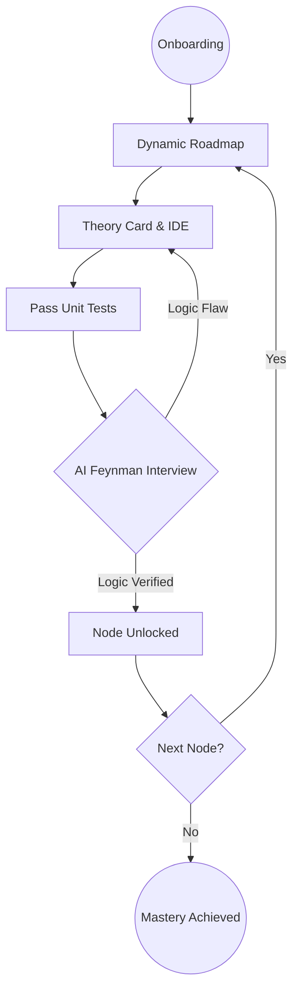

# code-learning-platform-be

```text
code-learning-platform-be/
├── src/
│   ├── config/         # Configuration files (DB, etc.)
│   ├── controllers/    # Request handlers & Business logic
│   ├── middlewares/    # Express middlewares (auth, validation)
│   ├── models/         # Mongoose models & Types
│   ├── routes/         # API Route definitions
│   ├── utils/          # Helper functions & Utilities
│   └── index.ts        # Entry point
├── dist/               # Compiled JavaScript (ignored by git)
├── tsconfig.json       # TypeScript configuration
├── package.json
├── .env                # Private environment variables
├── .env.example        # Template for environment variables
├── .gitignore
├── Dockerfile
└── README.md
```

## Directory Structure Explanation

| Directory          | Description                                                         |
| :----------------- | :------------------------------------------------------------------ |
| **`config/`**      | Database connections, external API configurations.                  |
| **`controllers/`** | Logic for handling requests and returning responses.                |
| **`middlewares/`** | Functions that run before controllers (e.g., Auth, Error handling). |
| **`models/`**      | Data schemas (Mongoose) and TypeScript interfaces.                  |
| **`routes/`**      | Mapping of URL paths to specific controllers.                       |
| **`utils/`**       | Common utility functions used across the project.                   |
| **`index.ts`**     | The main application setup and server initialization.               |

# Setup and Run

1.  **Install dependencies**:

    ```bash
    yarn install
    ```

2.  **Environment Variables**:
    Copy `.env.example` to `.env` and fill in your credentials.

    ```bash
    cp .env.example .env
    ```

3.  **Run in Development** (Hot-reload with `ts-node`):

    ```bash
    yarn dev
    ```

4.  **Build for Production**:

    ```bash
    yarn build
    ```

5.  **Run Production Build**:
    ```bash
    yarn start
    ```

# CodeStep: Deep Learning Through Teaching

CodeStep is an AI-driven educational platform designed to help absolute beginners master **C++** and **Java** using the **Feynman Technique**. Unlike traditional platforms that focus on syntax or passing test cases, CodeStep ensures users truly understand the logic behind their code by requiring them to "teach" it to an AI.

---

## Table of Contents

- [1. The Problem Statement](#-1-the-problem-statement)
- [2. The CodeStep Solution](#-2-the-codestep-solution)
- [3. Target Audience](#-3-target-audience)
- [4. Core Features](#-4-core-features)
- [5. The Learning Journey](#-5-the-learning-journey)
- [6. Technical Architecture](#-7-technical-architecture)
- [7. MVP Implementation Priority](#-8-mvp-implementation-priority)

---

## 1. The Problem Statement: The "Surface-Level" Trap

Beginners often fall into a cycle of "rote learning" where they can pass exercises but fail to apply logic in real-world scenarios.

| Challenge                | Impact on Learners                                                                         |
| :----------------------- | :----------------------------------------------------------------------------------------- |
| **Syntax vs. Logic Gap** | Users copy-paste code or use trial-and-error until tests pass without understanding _why_. |
| **Knowledge Decay**      | Without a structured review system, foundational concepts are forgotten within 48 hours.   |
| **Motivation Loss**      | Complex environment setups (compilers, IDEs) create high friction for absolute beginners.  |
| **Lack of Context**      | Difficulty translating abstract programming concepts into practical, logical steps.        |

---

## 2. The CodeStep Solution: The Feynman Method

CodeStep leverages the **Feynman Technique**: _If you want to master a concept, explain it to someone else in simple terms._

The platform acts as the student, and the user acts as the teacher.

- **Unit Tests are just the start**: Passing test cases only proves your code _works_.
- **The Feynman Interview is the Gate**: After passing tests, users enter an AI-powered interview. They must explain their logic, line-by-line, to the AI. If the explanation is sound, the next concept is unlocked.

---

## 3. Target Audience

- **Absolute Beginners**: Individuals with zero coding experience who need a high-accountability, guided path.
- **Logic-Focused Students**: Developers looking to move beyond "coding by rote" toward deep architectural understanding.

---

## 4. Core Features

### A. Personalized Onboarding

- **Strategic Quiz**: Tailors the roadmap based on goals and current technical aptitude.
- **Environment Sync**: Guided setup for local IDEs (VS Code) to ensure bridge between web learning and professional tools.

### B. The Mastery Experience

- **Split-Screen IDE**: Integrated development environment paired with Theory Cards for seamless learning.
- **AI Feynman Interview**: The "Unlock" gate. Targeted questioning based on the user's specific implementation.

### C. Retention & Gamification

- **Dynamic Roadmap**: An interactive, visual map of the learning path where nodes unlock sequentially.
- **Spaced Repetition Widget**: Daily logic-based questions that adjust frequency based on performance.
- **Progression Systems**: Streaks, XP, and badges to maintain engagement.

---

## 5. The Learning Journey



---

## 6. Technical Architecture

| Component     | Technology                                  |
| :------------ | :------------------------------------------ |
| **Frontend**  | React 19, TypeScript, Vite, Tailwind CSS v4 |
| **Backend**   | ExpressJS (Node.js), TypeScript             |
| **Database**  | MongoDB (User data, Progress, Roadmap)      |
| **AI Engine** | OpenAI API (GPT-4o)                         |
| **Execution** | Specialized Code Execution API (C++/Java)   |

---

## 7. MVP Implementation Priority

1.  **Auth & Persistence**: Secure user login and progress tracking in MongoDB.
2.  **Split-Screen IDE**: Integration of a coding interface with a backend execution engine.
3.  **Feynman Interview Logic**: Prompt engineering the AI to act as a challenging but encouraging "interviewer."
4.  **Roadmap Visualization**: Building the interactive SVG/Canvas roadmap UI.

---
