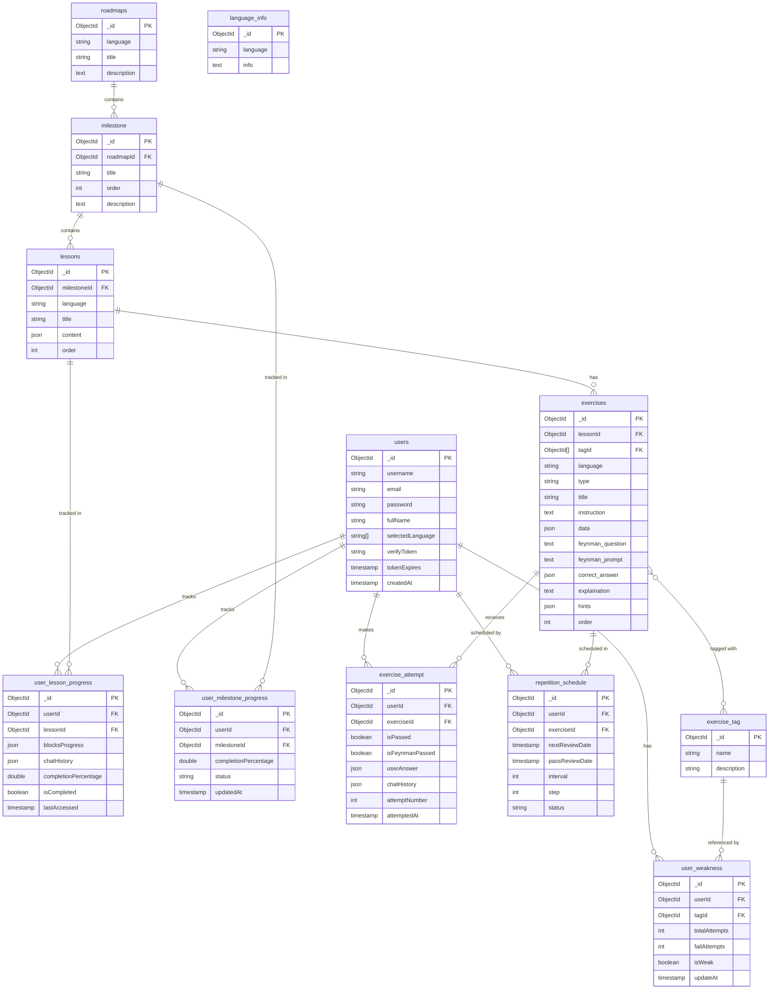

# Database Design — CodeStep Learning Platform

## 1. ERD Diagram



---

## 2. Entity List

| Collection | Description |
| --- | --- |
| `users` | Platform accounts. Stores profile metadata, credentials, and language preferences set during onboarding. |
| `language_info` | Static reference content (pros, cons, use cases) displayed on the language selection page during onboarding. |
| `roadmaps` | Top-level learning path per language. Generated once and shared across all users who select that language. |
| `milestone` | A named learning stage within a roadmap (e.g. "Variables & Types", "Control Flow"). Milestones group related lessons and gate progression. |
| `lessons` | Individual lessons within a milestone, delivered as sequential Learning Blocks. Each block pairs theory with an interactive task. |
| `exercises` | Interactive tasks (drag-and-drop or fill-in-the-blank) attached to lesson blocks. Includes the Feynman verification prompt and pre-authored hints. |
| `exercise_tag` | Taxonomy of knowledge concepts (e.g. "loops", "pointers", "OOP") used to tag exercises and drive weakness tracking. |
| `user_lesson_progress` | Per-user per-lesson progress. Tracks block-level completion state and overall lesson completion percentage. |
| `user_milestone_progress` | Aggregated per-user per-milestone progress. Used to render the roadmap and manage locked/unlocked state. |
| `exercise_attempt` | Records each attempt a user makes on an exercise, including the submitted answer and Feynman pass/fail outcome. |
| `repetition_schedule` | Drives the spaced repetition system for the Daily Question feature. Stores the next review date and interval for each user/exercise pair. |
| `user_weakness` | Aggregates failure data per knowledge tag per user. Used to rank and surface recommended exercises on the Practice page. |

---

## 3. Relationship Summary

| Relationship | Type | Description |
| --- | --- | --- |
| `roadmaps` → `milestone` | One-to-Many | A roadmap contains multiple ordered milestones. |
| `milestone` → `lessons` | One-to-Many | A milestone contains multiple ordered lessons. |
| `lessons` → `exercises` | One-to-Many | A lesson may contain multiple exercises, one per block. |
| `exercises` ↔ `exercise_tag` | Many-to-Many | An exercise can carry multiple tags; a tag applies to many exercises. Modelled as an embedded `tagId[]` array on `exercises`. |
| `users` → `user_lesson_progress` | One-to-Many | A user has one progress record per lesson they have interacted with. |
| `users` → `user_milestone_progress` | One-to-Many | A user has one progress record per milestone on their roadmap. |
| `users` → `exercise_attempt` | One-to-Many | A user submits one or more attempts per exercise over time. |
| `users` → `repetition_schedule` | One-to-Many | A user has one SRS schedule record per exercise they have completed. |
| `users` → `user_weakness` | One-to-Many | A user has one weakness record per knowledge tag they have been assessed against. |
| `exercises` → `exercise_attempt` | One-to-Many | An exercise receives attempts from many users over time. |
| `exercises` → `repetition_schedule` | One-to-Many | An exercise may be scheduled for review for many users independently. |
| `exercise_tag` → `user_weakness` | One-to-Many | A tag is referenced by one weakness record per user. |

---

## 4. Collection Definitions

### 4.1 `users`

Stores application-level account data and onboarding preferences.

| Field | Type | Constraints | Description |
| --- | --- | --- | --- |
| `_id` | `ObjectId` | PK | Unique user identifier. |
| `username` | `string` | NOT NULL, UNIQUE | Chosen display handle. |
| `email` | `string` | NOT NULL, UNIQUE | Used for login and verification. |
| `password` | `string` | NOT NULL | Bcrypt-hashed credential. Never store plaintext. |
| `fullName` | `string` | NOT NULL | User's full display name. |
| `selectedLanguage` | `string[]` | NOT NULL | Languages chosen during onboarding. Values: `"cpp"` \| `"java"`. |
| `verifyToken` | `string` |  | Email verification token or OTP. |
| `tokenExpires` | `timestamp` |  | Expiry time for `verifyToken`. |
| `createdAt` | `timestamp` | NOT NULL, DEFAULT now | Account creation time. |

---

### 4.2 `language_info`

Static reference data shown on the language selection screen. Seeded once; not user-specific.

| Field | Type | Constraints | Description |
| --- | --- | --- | --- |
| `_id` | `ObjectId` | PK |  |
| `language` | `string` | NOT NULL, UNIQUE | Language identifier: `"cpp"` \| `"java"`. |
| `info` | `text` | NOT NULL | Markdown content covering pros, cons, and common use cases. |

---

### 4.3 `roadmaps`

Top-level curriculum definition per language. Shared across all users; not user-specific.

| Field | Type | Constraints | Description |
| --- | --- | --- | --- |
| `_id` | `ObjectId` | PK |  |
| `language` | `string` | NOT NULL, UNIQUE | `"cpp"` \| `"java"`. |
| `title` | `string` | NOT NULL | Display title (e.g. `"C++ Learning Roadmap"`). |
| `description` | `text` |  | Summary shown on the roadmap page. |

---

### 4.4 `milestone`

A named learning stage within a roadmap. Groups related lessons and gates progression.

| Field | Type | Constraints | Description |
| --- | --- | --- | --- |
| `_id` | `ObjectId` | PK |  |
| `roadmapId` | `ObjectId` | NOT NULL, FK → `roadmaps._id` | The roadmap this milestone belongs to. |
| `title` | `string` | NOT NULL | Stage name (e.g. `"Control Flow"`). |
| `order` | `int` | NOT NULL | Sequential position within the roadmap. |
| `description` | `text` |  | Summary shown when the user hovers over the milestone node. |

---

### 4.5 `lessons`

Individual lessons delivered as sequential Learning Blocks. Each block pairs a theory card with an interactive exercise.

| Field | Type | Constraints | Description |
| --- | --- | --- | --- |
| `_id` | `ObjectId` | PK |  |
| `milestoneId` | `ObjectId` | NOT NULL, FK → `milestone._id` | The milestone this lesson belongs to. |
| `language` | `string` | NOT NULL | `"cpp"` \| `"java"`. |
| `title` | `string` | NOT NULL | Lesson display name. |
| `content` | `json` | NOT NULL | Ordered array of Learning Block objects. See schema below. |
| `order` | `int` | NOT NULL | Sequence position within the milestone. |

**`content` block schema:**

```json
[
  {
    "blockId": "b1",
    "theory": {
      "text": "Markdown content",
      "image": "https://cdn.example.com/visual.png"
    },
    "exampleCode": {
      "code": "int a = 5;",
      "explanation": "Declares an integer variable."
    },
    "practice": {
      "exerciseId": "<ObjectId>",
      "requiredToPass": true
    },
    "feynmanQuestion": "Why do we use a for loop here instead of while?",
    "feynmanPrompt": "System prompt for AI Feynman evaluator...",
    "order": 1
  }
]
```

---

### 4.6 `exercise_tag`

Taxonomy of knowledge concepts. Used to tag exercises and drive weakness detection.

| Field | Type | Constraints | Description |
| --- | --- | --- | --- |
| `_id` | `ObjectId` | PK |  |
| `name` | `string` | NOT NULL, UNIQUE | Concept label (e.g. `"loops"`, `"pointers"`, `"OOP"`). |
| `description` | `string` |  | Human-readable explanation of what this tag covers. |

---

### 4.7 `exercises`

Interactive tasks attached to lesson blocks. Supports drag-and-drop and fill-in-the-blank formats. Also used as standalone free-practice items.

| Field | Type | Constraints | Description |
| --- | --- | --- | --- |
| `_id` | `ObjectId` | PK |  |
| `lessonId` | `ObjectId` | FK → `lessons._id`, NULLABLE | The lesson this exercise belongs to. `null` for free-practice exercises not tied to a lesson. |
| `tagId` | `ObjectId[]` | NOT NULL | Array of tag IDs → `exercise_tag._id`. |
| `language` | `string` | NOT NULL | `"cpp"` \| `"java"`. |
| `type` | `string` | NOT NULL | `"drag_drop"` \| `"fill_blank"`. |
| `title` | `string` | NOT NULL | Display title. |
| `instruction` | `text` | NOT NULL | Task description shown to the user. |
| `data` | `json` | NOT NULL | Exercise-specific display payload. See schema below. |
| `feynman_question` | `text` |  | Opening question asked by the AI after submission. |
| `feynman_prompt` | `text` |  | System prompt for the Feynman AI evaluator. |
| `correct_answer` | `json` | NOT NULL | Expected answer used for validation (e.g. `{ "input_1": "int", "input_2": "10" }`). |
| `explaination` | `text` |  | Shown to the user after an incorrect submission. |
| `hints` | `json` |  | Ordered hint array. See schema below. |
| `order` | `int` | NOT NULL | Position within the lesson. |

**`data` schema:**

```json
{
  "template": ["int a = ", " ;", "cout << a;"],
  "placeholders": { "input_1": "type", "input_2": "value" },
  "options": ["10", "int", "float", "string"]
}
```

**`hints` schema:**

```json
{ "1": "Gợi ý về lý thuyết", "2": "Gợi ý về logic" }
```

---

### 4.8 `user_lesson_progress`

Tracks a user's block-by-block progress through a lesson.

| Field | Type | Constraints | Description |
| --- | --- | --- | --- |
| `_id` | `ObjectId` | PK |  |
| `userId` | `ObjectId` | NOT NULL, FK → `users._id` |  |
| `lessonId` | `ObjectId` | NOT NULL, FK → `lessons._id` |  |
| `blocksProgress` | `json` | NOT NULL | Array of per-block state objects. See schema below. |
| `chatHistory` | `json` |  | AI conversation history for this lesson. See schema below. |
| `completionPercentage` | `double` | NOT NULL, DEFAULT 0 | `(số block isFeynmanPassed / tổng số block) × 100`. |
| `isCompleted` | `boolean` | NOT NULL, DEFAULT false | True when all blocks are Feynman-passed. |
| `lastAccessed` | `timestamp` |  | Updated on every session entry. |

**`blocksProgress` schema:**

```json
[
  { "blockIndex": 0, "isFeynmanPassed": true },
  { "blockIndex": 1, "isFeynmanPassed": false }
]
```

**`chatHistory` schema:**

```json
[{ "role": "assistant", "content": "..." }]
```

---

### 4.9 `user_milestone_progress`

Aggregated progress per user per milestone. Used to render the roadmap and control node lock state.

| Field | Type | Constraints | Description |
| --- | --- | --- | --- |
| `_id` | `ObjectId` | PK |  |
| `userId` | `ObjectId` | NOT NULL, FK → `users._id` |  |
| `milestoneId` | `ObjectId` | NOT NULL, FK → `milestone._id` |  |
| `completionPercentage` | `double` | NOT NULL, DEFAULT 0 | Aggregated from all child `user_lesson_progress` records. |
| `status` | `string` | NOT NULL | `"locked"` \| `"active"` \| `"completed"`. |
| `updatedAt` | `timestamp` | NOT NULL | Updated whenever a child lesson progress changes. |

---

### 4.10 `exercise_attempt`

Records each attempt a user makes on an exercise, including the submitted answer and Feynman outcome.

| Field | Type | Constraints | Description |
| --- | --- | --- | --- |
| `_id` | `ObjectId` | PK |  |
| `userId` | `ObjectId` | NOT NULL, FK → `users._id` |  |
| `exerciseId` | `ObjectId` | NOT NULL, FK → `exercises._id` |  |
| `isPassed` | `boolean` | NOT NULL | Whether the submitted answer matched `correct_answer`. |
| `isFeynmanPassed` | `boolean` | NOT NULL | Whether the AI Feynman evaluator accepted the user's explanation. |
| `userAnswer` | `json` | NOT NULL | Snapshot of the user's submission (e.g. `{ "input_1": "float" }`). Passed to the AI for targeted error feedback. |
| `chatHistory` | `json` |  | Feynman conversation history for this specific attempt. |
| `attemptNumber` | `int` | NOT NULL | Increments per retry for this user/exercise pair. |
| `attemptedAt` | `timestamp` | NOT NULL, DEFAULT now |  |

---

### 4.11 `repetition_schedule`

Drives the spaced repetition system for the Daily Question feature. One record per user per completed exercise.

| Field | Type | Constraints | Description |
| --- | --- | --- | --- |
| `_id` | `ObjectId` | PK |  |
| `userId` | `ObjectId` | NOT NULL, FK → `users._id` |  |
| `exerciseId` | `ObjectId` | NOT NULL, FK → `exercises._id` |  |
| `nextReviewDate` | `timestamp` | NOT NULL | When this exercise re-appears in the daily queue. |
| `passReviewDate` | `timestamp` |  | Timestamp of the last successful review. |
| `interval` | `int` | NOT NULL | Current review interval in days. |
| `step` | `int` | NOT NULL | Internal step counter: correct `× 2`, incorrect `÷ 2`. |
| `status` | `string` | NOT NULL | `"learning"` \| `"reviewing"` \| `"mastered"`. |

---

### 4.12 `user_weakness`

Aggregates failure data per knowledge tag per user. Updated on every exercise attempt. Used to rank and highlight exercises on the Practice page.

| Field | Type | Constraints | Description |
| --- | --- | --- | --- |
| `_id` | `ObjectId` | PK |  |
| `userId` | `ObjectId` | NOT NULL, FK → `users._id` |  |
| `tagId` | `ObjectId` | NOT NULL, FK → `exercise_tag._id` |  |
| `totalAttempts` | `int` | NOT NULL, DEFAULT 0 | Total exercise attempts involving this tag. |
| `failAttempts` | `int` | NOT NULL, DEFAULT 0 | Number of those attempts that were not passed. |
| `isWeak` | `boolean` | NOT NULL | Whether this tag is considered a weakness for the user. |
| `updateAt` | `timestamp` | NOT NULL | Updated on every relevant `exercise_attempt` write. |
