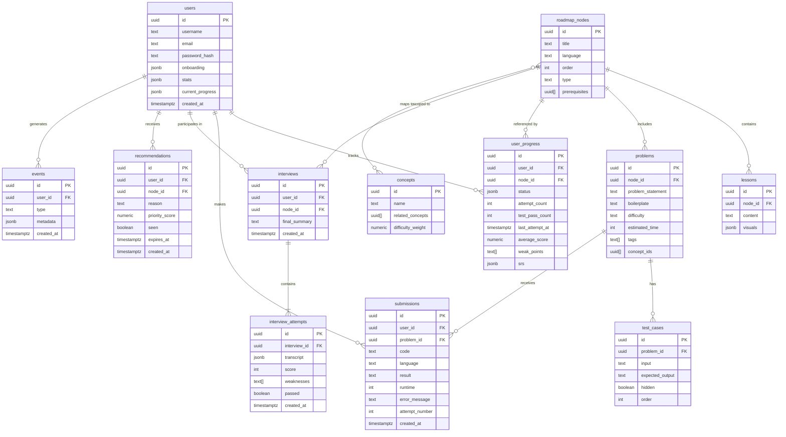

# Database Design: CodeStep Learning Platform

## 1. ERD Diagram

---

## 2. Entity List

| Entity | Description |
| --- | --- |
| `users` | Platform accounts. Stores profile metadata, onboarding preferences, gamification stats, and current roadmap progress. |
| `roadmap_nodes` | Ordered units of the learning curriculum, scoped to a language (C++ or Java). Each node has a type indicating whether it contains a lesson, problems, or both. |
| `lessons` | The theory content attached to a roadmap node. Contains rich text and optional visual assets. |
| `problems` | Coding challenges linked to a node. Includes the problem statement, boilerplate code, difficulty level, and estimated completion time. |
| `test_cases` | Input/output pairs used to validate a submission against a problem. Test cases may be hidden from the user. |
| `submissions` | A user's code attempt for a specific problem. Records the result, runtime, and any error output. |
| `user_progress` | The core personalization record per user per node. Tracks phase status, attempt history, weak points, and the spaced repetition schedule (SRS). |
| `interviews` | A Feynman Interview session linking a user to a specific roadmap node. Stores the final AI-generated summary. |
| `interview_attempts` | Individual attempt records within an interview. Contains the full transcript, score, identified weaknesses, and pass/fail outcome. |
| `concepts` | Reusable knowledge units that nodes and problems map to. Supports the recommendation engine and semantic weak-point tracking. |
| `recommendations` | AI-generated suggestions of nodes for a user to revisit or study next, ranked by priority and driven by SRS data and weak points. |
| `events` | Append-only audit log of user activity. Powers analytics, streak calculation, and future behavioural features. |

---

## 3. Relationship Summary

| Relationship | Type | Description |
| --- | --- | --- |
| `users` → `submissions` | One-to-Many | A user submits code attempts across many problems over time. |
| `users` → `user_progress` | One-to-Many | A user has one progress record per roadmap node they have interacted with. |
| `users` → `interviews` | One-to-Many | A user may have multiple Feynman Interview sessions across different nodes. |
| `users` → `recommendations` | One-to-Many | A user receives personalised node recommendations generated by the AI engine. |
| `users` → `events` | One-to-Many | All user activity is emitted as events for analytics and streak tracking. |
| `roadmap_nodes` → `lessons` | One-to-One | Each node has at most one lesson (theory card). |
| `roadmap_nodes` → `problems` | One-to-Many | A node may contain one or more coding problems. |
| `roadmap_nodes` → `user_progress` | One-to-Many | Many users can each have a progress record for the same node. |
| `roadmap_nodes` → `interviews` | One-to-Many | A node may be the subject of multiple interviews across different users. |
| `roadmap_nodes` ↔ `concepts` | Many-to-Many | Nodes map to one or more knowledge concepts; a concept may appear in many nodes. |
| `problems` → `test_cases` | One-to-Many | Each problem has one or more test cases (some hidden) used to validate submissions. |
| `problems` → `submissions` | One-to-Many | A problem receives submissions from many users over time. |
| `interviews` → `interview_attempts` | One-to-Many | An interview session contains one or more attempt records (retry flow). |

---

## 4. Table Definitions

### 4.1 `users`

Stores application-level profile data, onboarding configuration, and gamification state.

| Column | Type | Constraints | Description |
| --- | --- | --- | --- |
| `id` | `uuid` | PK, DEFAULT gen_random_uuid() | Unique user identifier. |
| `username` | `text` | NOT NULL, UNIQUE | Chosen display handle. |
| `email` | `text` | NOT NULL, UNIQUE | User's email address. |
| `password_hash` | `text` | NOT NULL | Hashed credential. Never store plaintext. |
| `onboarding` | `jsonb` |  | `{ language, level, goal }` — captured during onboarding quiz. |
| `stats` | `jsonb` |  | `{ streak, lastActive, totalXP, badges: [] }` — gamification state. |
| `current_progress` | `jsonb` |  | `{ dailyGoal }` — active session preferences. Avoid storing `unlockedNodes` here; derive from `user_progress` instead. |
| `created_at` | `timestamptz` | NOT NULL, DEFAULT now() | Account creation timestamp. |

**Indexes:** `email`

---

### 4.2 `roadmap_nodes`

The ordered curriculum graph. Each node represents a discrete learning unit within a language track.

| Column | Type | Constraints | Description |
| --- | --- | --- | --- |
| `id` | `uuid` | PK, DEFAULT gen_random_uuid() |  |
| `title` | `text` | NOT NULL | Display name of the node (e.g., "Loops", "Pointers"). |
| `language` | `text` | NOT NULL, CHECK (`cpp`, `java`) | The language track this node belongs to. |
| `order` | `int` | NOT NULL | Sequence position within the track. |
| `type` | `text` | NOT NULL, CHECK (`lesson`, `problem`, `both`) | Determines what content is rendered for this node. |
| `prerequisites` | `uuid[]` |  | Array of node IDs that must be completed before this node unlocks. |

**Indexes:** `language`, `order`

---

### 4.3 `lessons`

Theory card content for a roadmap node.

| Column | Type | Constraints | Description |
| --- | --- | --- | --- |
| `id` | `uuid` | PK, DEFAULT gen_random_uuid() |  |
| `node_id` | `uuid` | NOT NULL, UNIQUE, FK → `roadmap_nodes(id)` | The node this lesson belongs to. UNIQUE enforces one lesson per node. |
| `content` | `text` | NOT NULL | Rich text body of the lesson (markdown or structured HTML). |
| `visuals` | `jsonb` |  | Array of `{ type: 'image' \| 'diagram', url: string, caption: string }` objects. |

---

### 4.4 `problems`

Coding challenges associated with a roadmap node.

| Column | Type | Constraints | Description |
| --- | --- | --- | --- |
| `id` | `uuid` | PK, DEFAULT gen_random_uuid() |  |
| `node_id` | `uuid` | NOT NULL, FK → `roadmap_nodes(id)` | The node this problem belongs to. |
| `problem_statement` | `text` | NOT NULL | Full description of the problem. |
| `boilerplate` | `text` |  | Starter code shown to the user in the IDE. |
| `difficulty` | `text` | NOT NULL, CHECK (`easy`, `medium`, `hard`) | Difficulty rating. |
| `estimated_time` | `int` |  | Estimated completion time in minutes. |
| `tags` | `text[]` |  | Searchable topic tags (e.g., `["arrays", "recursion"]`). |
| `concept_ids` | `uuid[]` |  | References to `concepts` records. Used by the recommendation engine. |

**Indexes:** `node_id`

---

### 4.5 `test_cases`

Input/output pairs used to validate submissions against a problem.

| Column | Type | Constraints | Description |
| --- | --- | --- | --- |
| `id` | `uuid` | PK, DEFAULT gen_random_uuid() |  |
| `problem_id` | `uuid` | NOT NULL, FK → `problems(id)` | The problem this test case belongs to. |
| `input` | `text` | NOT NULL | Input value(s) passed to the user's function. |
| `expected_output` | `text` | NOT NULL | Correct output the execution engine compares against. |
| `hidden` | `boolean` | NOT NULL, DEFAULT false | If true, the test case is not shown to the user. |
| `order` | `int` | NOT NULL | Display order for visible test cases. |

**Indexes:** `problem_id`

---

### 4.6 `submissions`

A user's code attempt for a specific problem, including the execution result.

| Column | Type | Constraints | Description |
| --- | --- | --- | --- |
| `id` | `uuid` | PK, DEFAULT gen_random_uuid() |  |
| `user_id` | `uuid` | NOT NULL, FK → `users(id)` | The user who submitted. |
| `problem_id` | `uuid` | NOT NULL, FK → `problems(id)` | The problem being attempted. |
| `code` | `text` | NOT NULL | The submitted source code. |
| `language` | `text` | NOT NULL, CHECK (`cpp`, `java`) | Language the code was written in. |
| `result` | `text` | NOT NULL, CHECK (`accepted`, `wrong_answer`, `runtime_error`, `compile_error`, `timeout`) | Execution outcome. |
| `runtime` | `int` |  | Execution time in milliseconds. |
| `error_message` | `text` |  | Compiler or runtime error output, if any. |
| `attempt_number` | `int` | NOT NULL | Sequential attempt count for this user/problem pair. Enables progress-over-time queries. |
| `created_at` | `timestamptz` | NOT NULL, DEFAULT now() | Submission timestamp. |

**Indexes:** `user_id`, `problem_id`

---

### 4.7 `user_progress`

The primary personalization record. One row per user per roadmap node. Drives SRS scheduling, weak point detection, and recommendations.

| Column | Type | Constraints | Description |
| --- | --- | --- | --- |
| `id` | `uuid` | PK, DEFAULT gen_random_uuid() |  |
| `user_id` | `uuid` | NOT NULL, FK → `users(id)` | The user this record belongs to. |
| `node_id` | `uuid` | NOT NULL, FK → `roadmap_nodes(id)` | The node being tracked. |
| `status` | `jsonb` | NOT NULL | `{ phase: 'locked' \| 'unlocked' \| 'in_progress' \| 'completed', updatedAt }` |
| `attempt_count` | `int` | NOT NULL, DEFAULT 0 | Total number of problem attempts on this node. |
| `test_pass_count` | `int` | NOT NULL, DEFAULT 0 | Number of test cases passed across all submissions. |
| `last_attempt_at` | `timestamptz` |  | Timestamp of the most recent submission on this node. |
| `average_score` | `numeric(4,2)` |  | Rolling average score across interview attempts for this node. |
| `weak_points` | `text[]` |  | Concept or skill tags flagged as weak by the AI evaluator. |
| `srs` | `jsonb` |  | `{ nextReviewDate, interval, difficultyFactor, lastScore, reviewHistory: [] }` — spaced repetition state. |

**Constraints:** UNIQUE (`user_id`, `node_id`)

**Indexes:** `user_id`, `node_id`

---

### 4.8 `interviews`

A Feynman Interview session, linking a user to a node for AI-driven explanation assessment.

| Column | Type | Constraints | Description |
| --- | --- | --- | --- |
| `id` | `uuid` | PK, DEFAULT gen_random_uuid() |  |
| `user_id` | `uuid` | NOT NULL, FK → `users(id)` | The user being interviewed. |
| `node_id` | `uuid` | NOT NULL, FK → `roadmap_nodes(id)` | The node concept being explained. |
| `final_summary` | `text` |  | AI-generated summary of the user's overall explanation quality across all attempts. |
| `created_at` | `timestamptz` | NOT NULL, DEFAULT now() | When the interview session was initiated. |

**Indexes:** `user_id`, `node_id`

---

### 4.9 `interview_attempts`

Individual attempt records within an interview session. Captures the full conversation and outcome.

| Column | Type | Constraints | Description |
| --- | --- | --- | --- |
| `id` | `uuid` | PK, DEFAULT gen_random_uuid() |  |
| `interview_id` | `uuid` | NOT NULL, FK → `interviews(id)` | The parent interview session. |
| `transcript` | `jsonb` | NOT NULL | Array of `{ speaker: 'ai' \| 'user', message: string, timestamp }` objects. |
| `score` | `int` | CHECK (0–100) | Numeric quality score assigned by the AI evaluator. |
| `weaknesses` | `text[]` |  | Specific logic gaps or misconceptions identified in this attempt. |
| `passed` | `boolean` | NOT NULL, DEFAULT false | Whether the AI determined the explanation was satisfactory to unlock the next node. |
| `created_at` | `timestamptz` | NOT NULL, DEFAULT now() | Attempt timestamp. |

**Indexes:** `interview_id`

---

### 4.10 `concepts`

Reusable knowledge units that roadmap nodes and problems map to. Supports the AI recommendation engine and weak-point graph.

| Column | Type | Constraints | Description |
| --- | --- | --- | --- |
| `id` | `uuid` | PK, DEFAULT gen_random_uuid() |  |
| `name` | `text` | NOT NULL, UNIQUE | Concept label (e.g., "Recursion", "Heap Memory", "Polymorphism"). |
| `related_concepts` | `uuid[]` |  | IDs of semantically related concepts for graph traversal. |
| `difficulty_weight` | `numeric(3,2)` |  | Relative difficulty factor (0.0–1.0) used to calibrate SRS intervals. |

---

### 4.11 `recommendations`

AI-generated node suggestions for a user, ranked by relevance and driven by SRS and weak point data.

| Column | Type | Constraints | Description |
| --- | --- | --- | --- |
| `id` | `uuid` | PK, DEFAULT gen_random_uuid() |  |
| `user_id` | `uuid` | NOT NULL, FK → `users(id)` | The user receiving the recommendation. |
| `node_id` | `uuid` | NOT NULL, FK → `roadmap_nodes(id)` | The recommended node. |
| `reason` | `text` |  | Human-readable explanation of why this node was recommended. |
| `priority_score` | `numeric(5,2)` |  | Computed relevance score. Higher = more urgent to review. |
| `seen` | `boolean` | NOT NULL, DEFAULT false | Whether the user has been shown this recommendation. |
| `expires_at` | `timestamptz` |  | TTL after which the recommendation is considered stale and should be dismissed. |
| `created_at` | `timestamptz` | NOT NULL, DEFAULT now() | When the recommendation was generated. |

**Indexes:** `user_id`, `expires_at`

---

### 4.12 `events`

Append-only activity log. Used for analytics, streak calculation, and future behavioural modelling.

| Column | Type | Constraints | Description |
| --- | --- | --- | --- |
| `id` | `uuid` | PK, DEFAULT gen_random_uuid() |  |
| `user_id` | `uuid` | NOT NULL, FK → `users(id)` | The user who triggered the event. |
| `type` | `text` | NOT NULL | Event category (e.g., `submission_created`, `interview_passed`, `node_unlocked`, `lesson_viewed`). |
| `metadata` | `jsonb` |  | Arbitrary payload specific to the event type (e.g., `{ nodeId, score, language }`). |
| `created_at` | `timestamptz` | NOT NULL, DEFAULT now() | Event timestamp. |

**Indexes:** `user_id`, `created_at`, `type`

---

## 5. Notes

- **Auth integration:** `users.id` should be linked to your auth provider's user record (e.g., a Supabase `auth.users(id)` foreign key). The profile row is created via a database trigger on new user registration.
- **Row-Level Security (RLS):** All tables containing user data should have RLS enabled. Users may only read and write their own `submissions`, `user_progress`, `interviews`, `interview_attempts`, `recommendations`, and `events`. The `roadmap_nodes`, `lessons`, `problems`, `test_cases`, and `concepts` tables are read-only for all authenticated users.
- **Async evaluation:** The `interview_attempts.passed` field and `user_progress.status` are only updated once the AI evaluation job completes. Consider a lightweight status field on `interview_attempts` (e.g., `evaluating` → `completed`) if evaluation latency is significant.
- **SRS shape:** `user_progress.srs` — `{ nextReviewDate: timestamptz, interval: int (days), difficultyFactor: float, lastScore: int, reviewHistory: [{ date, score, interval }] }`.
- **Concepts graph (deferred):** The `roadmap_nodes` ↔ `concepts` many-to-many join should be implemented as a dedicated `node_concepts` join table in production rather than a `uuid[]` array, to support indexed lookups. Defer until post-MVP.
- **`users.current_progress.unlockedNodes` anti-pattern:** Do not store an unbounded array of unlocked node IDs on the `users` document. Derive unlocked state from `user_progress` records where `status.phase = 'completed'` to avoid unbounded document growth.
- **Band score scale:** `interview_attempts.score` uses a 0–100 integer scale internally. Map to IELTS-equivalent band scores (0–9) in the application layer if needed for display.

### MVP Scope Recommendation

Focus on:

1. `users`
2. `roadmap_nodes` + `lessons`
3. `problems` + `test_cases`
4. `submissions`
5. `user_progress`
6. `interviews` + `interview_attempts`

Defer:

- `concepts` graph and `node_concepts` join table
- `recommendations` engine
- AI embeddings / semantic memory
- Advanced `events` analytics pipeline
